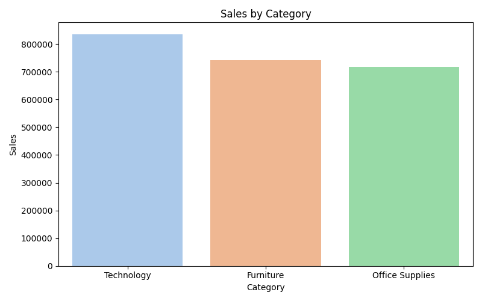

# Superstore — SQL & Data Analysis

Professional, recruiter-ready analysis of the "Sample – Superstore" dataset. This repository shows an SQL-first workflow, reproducible data cleaning, and static chart exports suitable for a portfolio or interview.

Author: Abhinav Verma — https://github.com/Abhinav-TheAnalyst

Table of contents
-----------------
- [Project overview](#project-overview)
- [Quick links](#quick-links)
- [Environment & Python version](#environment--python-version)
- [Quick start (reproduce visuals)](#quick-start-reproduce-visuals)
- [KPIs (from latest run)](#kpis-from-latest-run)
- [Visuals (embedded)](#visuals-embedded)
- [SQL + Notebook](#sql--notebook)
- [Files changed / added by last run](#files-changed--added-by-last-run)
- [Next improvements](#next-improvements)

Project overview
----------------
This repo provides:

- a lightweight cleaning & charting script (`scripts/generate_charts.py`)
- ordered SQL analysis scripts in `sql/` (01 → 07)
- a short exploratory notebook (`notebooks/analysis.ipynb`)
- a small dashboard folder with exported PNGs (`dashboard/screenshots/`)

Quick links
-----------
- Raw dataset (not committed): `data/raw/Sample - Superstore.csv`
- Chart outputs: `dashboard/screenshots/` (PNG + `kpis.json`)
- Chart generator: `scripts/generate_charts.py`
- Notebook: `notebooks/analysis.ipynb`
- Executive summary: `reports/executive_summary.md`

Environment & Python version
----------------------------
- Tested with: Python 3.10+ (the workspace used Python 3.14 during generation). Use Python 3.10 or newer.
- Primary libraries: `pandas`, `matplotlib`, `seaborn`, `nbconvert` (for notebook export).

Install (PowerShell)
--------------------
```powershell
cd "d:\python projects\git\superstore dataset"
python -m venv .venv
.\.venv\Scripts\Activate.ps1
python -m pip install --upgrade pip
python -m pip install pandas matplotlib seaborn jupyter nbconvert
```

Quick start — reproduce visuals
------------------------------
1. Place the dataset at `data/raw/Sample - Superstore.csv`.
2. Generate charts and KPIs:

```powershell
python scripts\generate_charts.py "data/raw/Sample - Superstore.csv" "dashboard/screenshots/"
```

3. Optionally execute the notebook and export HTML (may require additional packages):

```powershell
python -m nbconvert --to html --execute "notebooks/analysis.ipynb" --output "notebooks/analysis_executed.html"
```

KPIs (from the latest run)
-------------------------
The chart generator writes `dashboard/screenshots/kpis.json`. The latest values are:

- **Total sales:** `2,297,200.86`
- **Total profit:** `286,397.02`
- **Top region by profit:** `West`

Visuals (embedded)
-------------------
All visuals were created with `matplotlib` + `seaborn` and saved to `dashboard/screenshots/`.

- **Profit by region**

   

   Short interpretation: The `West` region shows the highest aggregated profit in this dataset.

- **Discount vs Profit**

   

   Short interpretation: The scatter shows many low-profit observations at higher discount levels; a smoothed trend is included.

- **Top customers (by profit)**

   

   Short interpretation: A small set of customers contributes a large share of profit.

- **Sales by category**

   

- **Monthly sales trend**

   

- **Top products by sales**

   

- **Discount distribution**

   

- **Correlation heatmap**

   

SQL + Notebook
--------------
- SQL scripts are located in `sql/` and are intended to be run in order (01 → 07). They contain the main analysis logic and final insights.
- The notebook `notebooks/analysis.ipynb` provides a runnable exploratory analysis; an executed HTML export is available at `notebooks/analysis_executed.html`.

Files changed / added by the last run
-----------------------------------
- `scripts/generate_charts.py` — expanded chart generator (new/updated)
- `dashboard/screenshots/*.png` — generated visuals
- `dashboard/screenshots/kpis.json` — KPI summary for quick reference
- `notebooks/analysis_executed.html` — executed notebook export

Next improvements (optional)
---------------------------
- Add `requirements.txt` to pin versions for reproducibility (I can add this).
- Produce higher-resolution images (`dpi=300`) for presentation/print.
- Add Plotly interactive exports and save `.html` interactive charts (requires `plotly` + `kaleido`).
- Create a GitHub Actions workflow to regenerate visuals and export the notebook on push.

Contributing
------------
If you'd like me to apply any of the optional improvements above, reply with the feature you want (for example: `requirements`, `high-res`, `plotly`, or `ci`). I will implement and push the changes.

Contact
-------
Author: Abhinav Verma — https://github.com/Abhinav-TheAnalyst

````markdown
# 🏬 Superstore SQL Business Analysis

## 📌 Project Overview

This project performs **end-to-end SQL-driven business analysis** on the *Sample – Superstore* dataset. The goal is to identify **profitability drivers, loss-making areas, and actionable business insights** that management can use to improve performance.

This is a **recruiter-focused project** showcasing SQL skills, business thinking, and structured analysis.

---

## 🎯 Business Problem

Retail company wants to understand:

* Which **regions, states, and categories** generate profit
* Which **products and discounts** cause losses
* Who are the **most valuable customers**
* How **discounting impacts profitability**

---

## 📊 Dataset Description

**Dataset:** Sample – Superstore (Kaggle)
# Superstore — SQL & Data Analysis

## Overview

This repository contains a practical, intermediate-level analysis of the "Sample — Superstore" dataset. The goal is to show end-to-end work: clean the data, load it into a simple analysis-ready format, run SQL-driven analysis, and produce concise business insights and recommendations. The project is written in a clear, human tone so it reads naturally for recruiters and hiring managers.

Source data comes from Kaggle: https://www.kaggle.com/datasets/vivek468/superstore-dataset-final

Author: Abhinav Verma — https://github.com/Abhinav-TheAnalyst / https://www.linkedin.com/in/abhinav-theanalyst/

---

## What you'll find here

- `data/raw/Superstore.csv` — original dataset (not committed here)
- `data/processed/superstore_cleaned.csv` — cleaned, analysis-ready CSV (generated by the script)
- `scripts/clean_data.py` — lightweight Python script (pandas) to clean and export the dataset
- `sql/` — collection of SQL queries used for the analysis, organized as step-by-step scripts
- `sql/table_schema.sql` — suggested table schema for loading into a relational DB
- `reports/executive_summary.md` — short, recruiter-friendly summary and recommendations
- `dashboard/README.md` — quick notes on building a dashboard (Power BI / Tableau)
- `requirements.txt` — minimal Python deps
- `.gitignore` — sensible ignores for this project

---

## Quick start (PowerShell)

1) Create a Python environment and install requirements:

```powershell
python -m venv .venv; .\\.venv\\Scripts\\Activate.ps1
pip install -r requirements.txt
```

2) Place the original `Superstore.csv` in `data/raw/`.

3) Run the cleaning script to produce `data/processed/superstore_cleaned.csv`:

```powershell
python scripts\\clean_data.py --input "data/raw/Superstore.csv" --output "data/processed/superstore_cleaned.csv"
```

4) Load the cleaned CSV into your RDBMS of choice (Postgres/MySQL/SQLite) or run the SQL files directly against a local SQLite DB after importing the CSV.

---

## Recommended workflow

1. Clean and standardize data using `scripts/clean_data.py`.
2. Load the cleaned CSV into a database (or use pandas / DuckDB for analysis).
3. Run the SQL scripts in `sql/` in order (01 → 07) to reproduce the analysis.
4. Use `reports/executive_summary.md` for the top-level talking points for interviews or the hiring manager.
 
````
