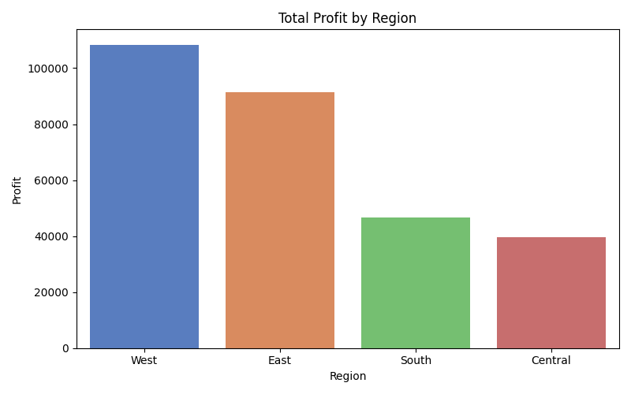
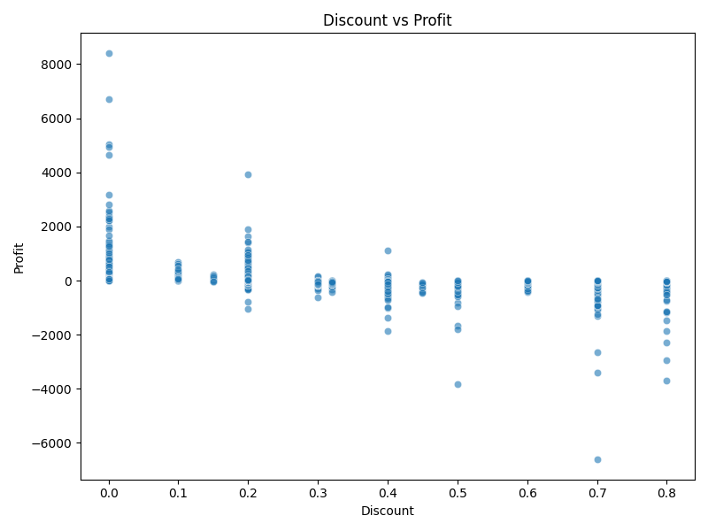
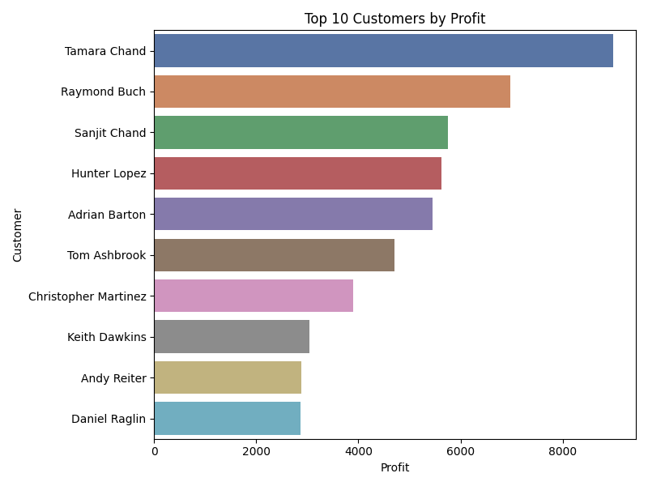
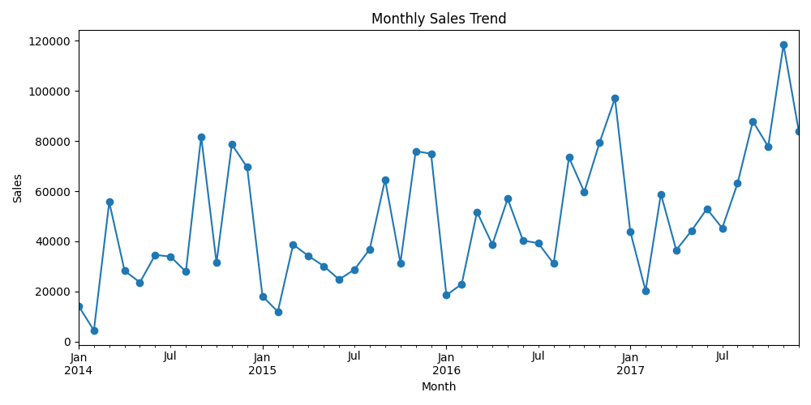
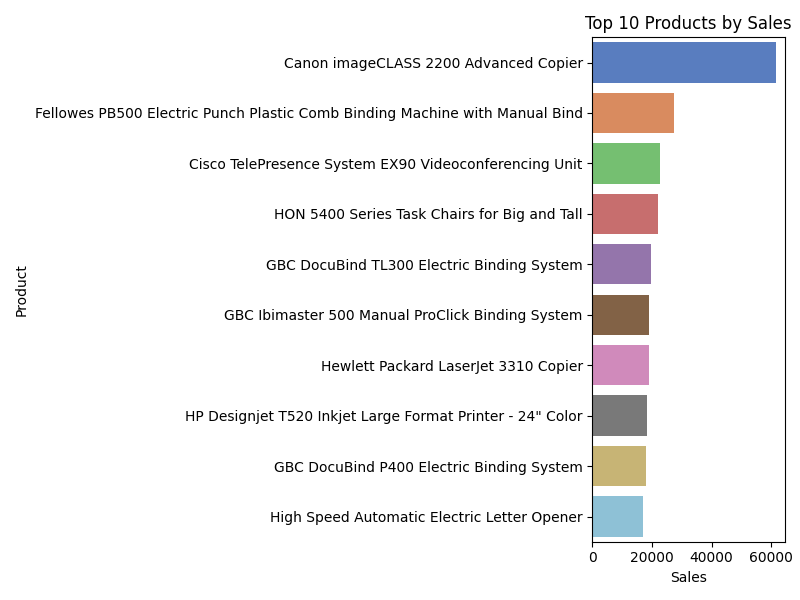
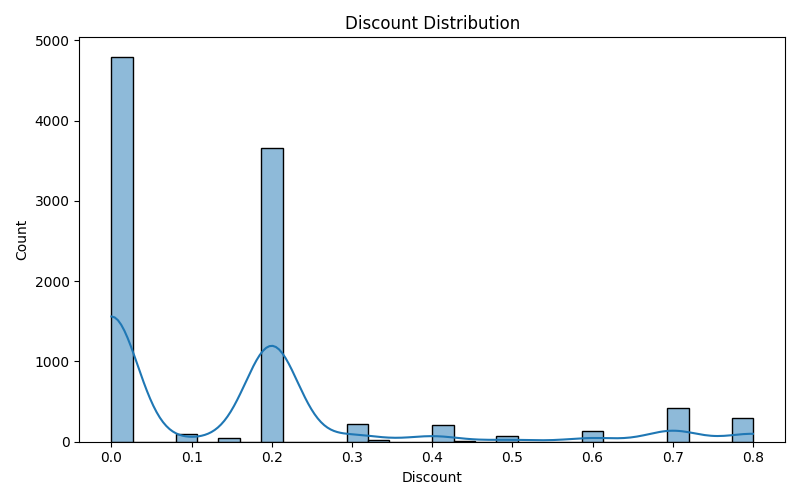
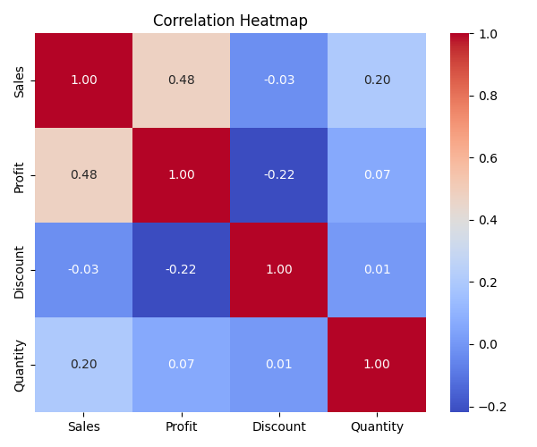

# Superstore — SQL & Data Analysis

Analysis of the "Sample – Superstore" dataset. This repository shows an SQL-first workflow, reproducible data cleaning, and static chart exports suitable for a portfolio or interview.

Author: Abhinav Verma — https://github.com/Abhinav-TheAnalyst

Table of contents
-----------------
- [Project overview](#project-overview)
- [Quick links](#quick-links)
- [Environment & Python version](#environment--python-version)
- [Quick start (reproduce visuals)](#quick-start-reproduce-visuals)
- [KPIs (from latest run)](#kpis-from-latest-run)
# Superstore — SQL & Data Analysis

A concise, recruiter-ready project demonstrating end-to-end SQL analysis, data cleaning, and dashboard-ready visualizations using the "Sample — Superstore" dataset.

Author: Abhinav Verma — https://github.com/Abhinav-TheAnalyst

---

## TL;DR (one-line resume bullet)
- Performed end-to-end SQL analysis and dashboard creation on the Superstore dataset to identify profit drivers and produce actionable recommendations.

---

## Contents
- Key business insights
- Quick KPI highlights
- Dashboard preview (thumbnails)
- SQL script highlights (01 → 07)
- How to reproduce (quick)
- Files of interest
- Next steps / contact

---

## Key business insights
Short, interview-ready insights derived from the SQL analysis and visuals.

- Top profitable regions: **West**, **East**, **South** (West leads in total profit).
- Discounting impact: average discount ≈ **15.6%**. Binned analysis shows average profit per order turns negative at roughly **28%** discount — review aggressive promotions above this level.
- Customer concentration: the **top 10 customers** by profit are responsible for a large share of profit — prioritize retention and tailored offers.
- Product focus: a small set of products and categories deliver the majority of sales — prioritize merchandising and inventory for high-performers.

- **Products with high sales but negative profit:**
   - Cisco TelePresence System EX90 Videoconferencing Unit
   - GBC DocuBind P400 Electric Binding System
   - High Speed Automatic Electric Letter Opener
   - Lexmark MX611dhe Monochrome Laser Printer
   - Martin Yale Chadless Opener Electric Letter Opener


---

## Quick KPI highlights
- **Total sales:** 2,297,200.86
- **Total profit:** 286,397.02
- **Average discount:** 15.6%
- **Avg profit per order:** 28.66
- **Discount threshold (avg profit → negative):** ≈ 28%

---

## Dashboard preview
Thumbnails give instant visual impact (full PNGs are in `dashboard/screenshots/`).

| Profit by region | Discount vs Profit | Top customers |
|---:|:---:|:---|
| {width=320} | {width=320} | {width=320} |

Caption: these charts show where profit concentrates, the effect of discounting on profit, and the customers contributing most to profitability.

---

## SQL script highlights (01 → 07)
Run scripts in order to reproduce the analysis; each is short and purpose-driven.

- `01_data_cleaning.sql` — clean and standardize raw tables (types, nulls, trimmed fields) to create analysis-ready tables.
- `02_sales_overview.sql` — compute top-level sales KPIs and time-based aggregates (sales / profit by year and month).
- `03_region_analysis.sql` — compare region-level performance and identify top/bottom-performing regions.
- `04_product_analysis.sql` — identify top products and categories driving revenue and profit.
- `05_discount_impact.sql` — quantify discounting behavior and its impact on profit (helps find loss thresholds).
- `06_customer_analysis.sql` — rank customers by revenue and profit and compute customer-level metrics.
- `07_final_insights.sql` — consolidate final tables and suggested business actions for reporting.

---

## How to reproduce (quick)
1. Place the dataset at `data/raw/Sample - Superstore.csv` (do not commit private data).
2. Create a Python environment and install dependencies (Python 3.10+ recommended):

```powershell
python -m venv .venv
.\.venv\Scripts\Activate.ps1
python -m pip install --upgrade pip
python -m pip install -r requirements.txt
```

3. Generate visuals and KPIs:

```powershell
python scripts\generate_charts.py "data/raw/Sample - Superstore.csv" "dashboard/screenshots/"
```

4. (Optional) Execute the notebook and export an HTML walkthrough:

```powershell
python -m nbconvert --to html --execute "notebooks/analysis.ipynb" --output "notebooks/analysis_executed.html"
```

---

## Files of interest
- `sql/` — SQL scripts (01 → 07)
- `scripts/generate_charts.py` — chart generator and KPI writer (`kpis.json`)
- `dashboard/screenshots/` — generated PNGs and `kpis.json`
- `notebooks/analysis.ipynb` — exploratory notebook

---

## Next steps / contact
- Suggested next steps: add GitHub Actions to regenerate visuals on push, export Plotly interactive charts, and produce presentation-grade PNGs (`dpi=300`).
- Author: Abhinav Verma — https://github.com/Abhinav-TheAnalyst

   

- **Top products by sales**

   

- **Discount distribution**

   

- **Correlation heatmap**

   

SQL + Notebook
--------------
- SQL scripts are located in `sql/` and are intended to be run in order (01 → 07). They contain the main analysis logic and final insights.
- The notebook `notebooks/analysis.ipynb` provides a runnable exploratory analysis; an executed HTML export is available at `notebooks/analysis_executed.html`.

Files changed / added by the last run
-----------------------------------
- `scripts/generate_charts.py` — expanded chart generator (new/updated)
- `dashboard/screenshots/*.png` — generated visuals
- `dashboard/screenshots/kpis.json` — KPI summary for quick reference
- `notebooks/analysis_executed.html` — executed notebook export

Contact
-------
Author: Abhinav Verma — https://github.com/Abhinav-TheAnalyst
